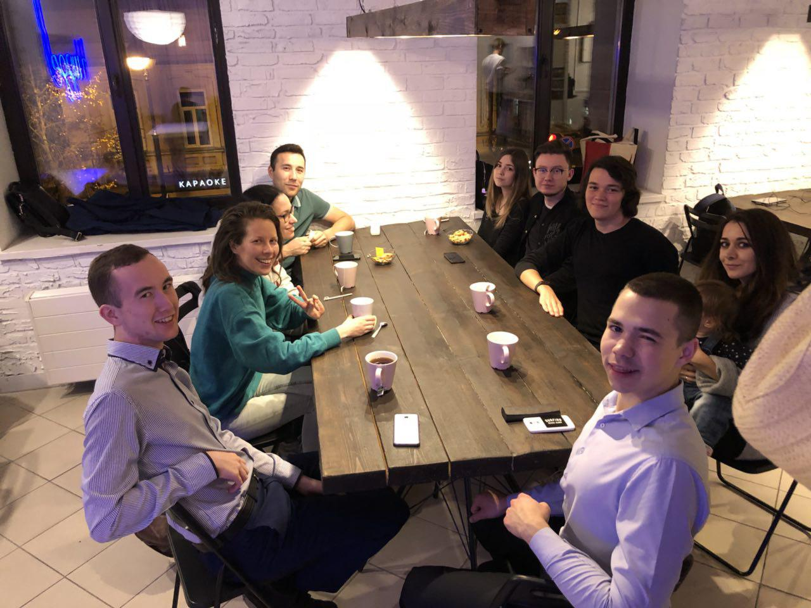

# English speaking club @ Baklazan

## Overview

English Speaking Club is a place where we speak and play games (like Taboo or a guessing game) using English.

Join us if you want more English speaking practice in your life or just looking for a place to find friends that like this wonderful language just like you do.

[{Telegram chat}](http://t.me/english_club_kzn)

## The place

Baklazan time cafe located at Островского 21.

Baklazan is a place where everything is free, expect for the time.

Normally, you pay 120 rub for the first hour and then 1 rub
per every minute. So, for example:

* One hour is 120 rub.
* Two hours is 180 rub.
* Three hours is 240 rub.

[{Baklazan group in vk}](https://vk.com/baklazankzn)
