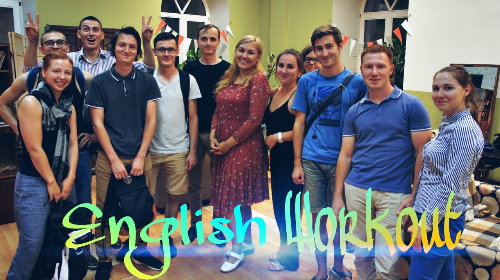

# English speaking club @ Ziferblat (Clockface)

## Overview

Learning English and want to find a way to practice it?
You've come to the right place!

Every meeting has a different topic for a discussion, but some aspects remain unchanged:
* There are both simple and "tough" topics
* We play mini-games
* Everyone is involved and can find something interesting

There are 2 meetings:
* One for beginners at every Sunday, 19:00
* One for advanced at every Thursday, 14:00

[{Club group in vk}](https://vk.com/event126029075)

## The place

Ziferblat (Clockface) time cafe located at Щапова 47.

You pay for the time you stay at the Ziferblat.

* First hour is 2.5 rub per minute.
* Second hour is 2 rub per minute.
* Third hour is 1 rub per minute.
* After the third hour you can stay for free.

In other words, you can't pay more than 330 rub.

> Coffee, tea and cookies are free.

[{Ziferblat group in vk}](https://vk.com/clockfacekzn)
