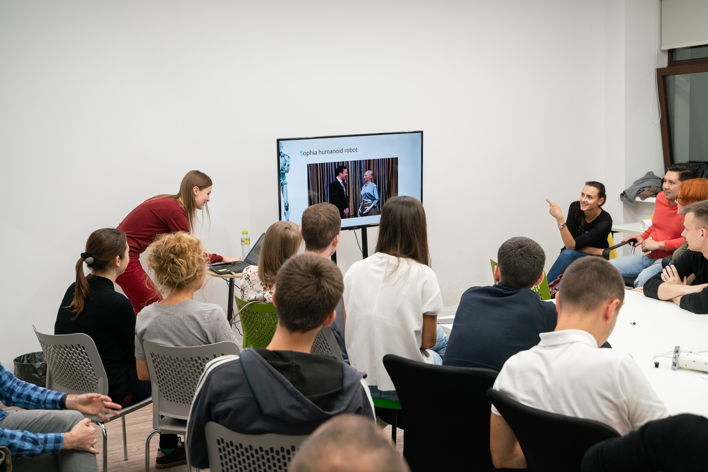

# English speaking club @ GrowUp

## Overview

GrowUp co-working invites you to the English evenings,
that happen at every Wednesday.

How often live gives chances to you that you miss so easily?
Quite often, isn't it?

But this time, you're lucky for sure!
Don't miss the chance to become a friend with English once and for all.
How? Visit our English speaking club at GrowUp!

Free, fun and effective.

There are 2 meetings:
* One for beginners at every Wednesday, 19:00
* One for advanced at every Thursday, 19:00

## The place

For beginners group, CoffeeBean cafe located at Университетская 10а.

[CoffeeBean group in vk](https://vk.com/coffeebeanofficial)

For advanced group, GrowUp co-woking located at Айвазовского 3а.

[{GrowUp group in vk}](https://vk.com/growupkzn)
