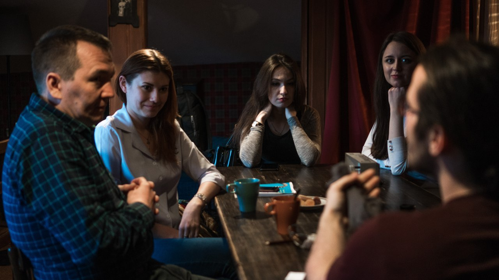

# French speaking club @ Ziferblat (Clockface)

## Overview

Happy news, French lovers of the Ziferblat: now you can stop hiding your love to everything
that is French-related, but rather share it in the French speaking club!

There are many reasons why you should learn French, but we think that you're already
convinced and have some familiarity with it.

Just in case, here is a some language information:
French is an official language of 33 countries. More than 43 countries speak French
and it's the number two most popular second language in the world.

[{Club group in vk}](https://vk.com/event120418108) 

## The place

Ziferblat (Clockface) time cafe located at Университетская 14.

You pay for the time you stay at the Ziferblat.
First hour is 2.5 rub per minute.
Second hour is 2 rub per minute.
Third hour is 1 rub per minute.
After the third hour you can stay for free.
In other words, you can't pay more than 330 rub.

Coffee, tea and cookies are free.

[{Ziferblat group in vk}](https://vk.com/clockfacekzn)
